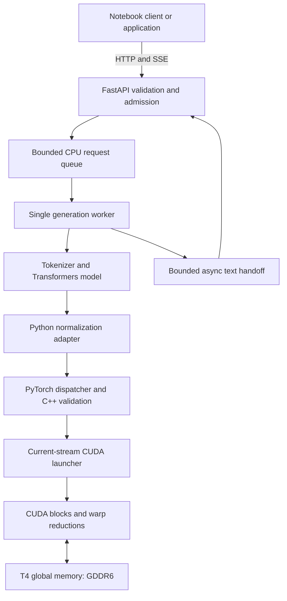

# System architecture and one request

Status: specified. Contracts: [operator](02-operator-contract.md), [HTTP and runtime](03-api-and-runtime.md). Decisions: [ADRs](04-decisions.md).

## Components



Attention, GEMMs, sampling and the framework's KV cache remain model/runtime operations. RMSNorm does not own request scheduling, tokenize text, modify weights, or manage the cache. A tunnel, when permitted, forwards HTTP; it is not part of the CUDA path.

## Startup

Load configuration and validate a single configured model alias. Inspect GPU/compiler/runtime versions. Load tokenizer and model at the pinned revision, explicitly choosing FP16 and eager attention. Move the model to one CUDA device; call `eval()`. Adapt supported normalization instances only after loading. Never load the model once per request.

Run a small reference/native smoke comparison and one bounded warmup generation before readiness. `backend=cuda` is the demo default; missing native support fails readiness. `backend=reference` is a separately labeled baseline server mode. Start one worker and its queue. Loading or failed warmup returns not-ready; liveness only indicates the process is responsive.

Weights and activations are tensor data in device memory. The extension is compiled executable code. Import loads its operator registration; kernel launch enqueues instructions that operate on framework-owned buffers. No separate manual allocation of a second copy of model weights is needed.

## One request, including prefill and decode

```mermaid
sequenceDiagram
    participant C as Client
    participant A as API
    participant W as Worker
    participant M as Model
    participant N as Native RMSNorm
    C->>A: POST messages and stream choice
    A->>A: Validate, template, tokenize, check context
    A->>W: Admit request or reject full queue
    W->>M: Move active inputs to GPU; prefill
    loop Norm sites in model forward
        M->>N: Tensor, existing gamma, epsilon
        N-->>M: Output tensor handle; work ordered on stream
    end
    M-->>W: Last-position logits and KV state
    W->>W: Select first generated token
    W-->>A: Decoded text when available
    A-->>C: SSE text delta
    loop Until EOS, cap, cancellation or deadline
        W->>M: Newly selected token and existing KV state
        M->>N: Normalization during cached decode
        N-->>M: Normalized activation
        M-->>W: Logits and updated KV state
        W-->>A: Next decoded text delta
        A-->>C: SSE text delta
    end
    W->>W: Release request tensors and KV references
    A-->>C: Finish reason and terminal sentinel
```

Chat formatting precedes tokenization using the pinned tokenizer template with generation prompt enabled. Avoid adding special tokens a second time. Prompt IDs/masks remain on CPU while queued. Only the active request receives GPU inputs and K/V storage.

Embedding maps token IDs into `[batch, sequence, hidden]` activations. Native RMSNorm sees rows obtained by flattening leading dimensions; it does not receive text or IDs. C++ extracts typed device addresses, validates metadata, allocates output with PyTorch, selects the input device and current stream, and enqueues the kernel. Host return may precede device completion; subsequent operations on that stream consume output in order. [CUDA semantics](https://docs.pytorch.org/docs/main/notes/cuda.html).

For TinyLlama, two norms per decoder block plus the final norm means 45 normalization sites per ordinary forward, derived from the pinned architecture. This is a predicted call count to verify with instrumentation, not a measured trace. Prefill supplies first-token logits; each later decode forward uses cached past state instead of processing the original prompt again.

The final LM head supplies logits. Greedy selection is the default; optional sampling is configured at request level. Text decoding can buffer several token IDs before producing a chunk, so one SSE event is not guaranteed to equal one model token. Prompt text is not echoed in generated output.

## Memory and lifetime

Model weights persist for the process. The active request owns inputs, K/V state and generation temporaries. Each normalization output is a new tensor with no input aliasing; the input and gamma remain unchanged. Shared memory contains reduction scalars initially. Register retention and shared-row staging are optional measured optimizations.

Cancelled queued requests release CPU state immediately. Active requests set a stop flag; the worker checks it between generation steps and releases references after completion. Do not reset the device or free buffers while in-flight work may reference them. A CUDA fault that compromises the context marks the worker unavailable and requires process/session restart.

## Repository ownership after implementation

| Directory | Responsibility |
|---|---|
| `aegis_norm/ops` | Public normalization API and reference dispatch |
| `aegis_norm/integrations` | Reversible model-instance adaptation |
| `csrc` | Operator registration, validation, launcher and kernels |
| `server` | Schemas, admission, generation worker, async stream transport |
| `tests` | Unit, CUDA, integration and functionality checks |
| `benchmarks` | Kernel, model and serving harnesses |
| `notebooks` | Provider setup, execution and export |
| `doc` | Requirements, design, protocols, findings and operations |

Directories above are planned components, not currently shipped modules. Tensor dispatch belongs in the package; request scheduling belongs in the server. Do not create a second general inference runtime merely to name a directory `runtime`.
