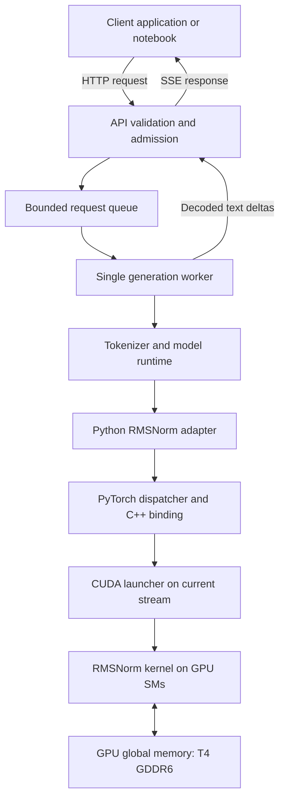
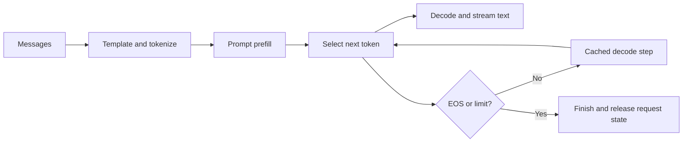
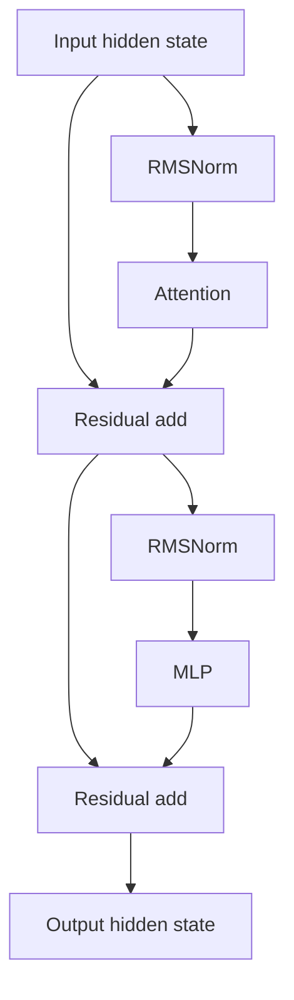

# Aegis-Norm product context

Status: curated project ideas and technical context. Application and CUDA implementation are planned; performance results are not yet measured.

This document consolidates the original idea collection into a readable product overview. It is exploratory context, not an authoritative requirements document. The [research findings](research/01-feasibility.md), [design exploration](research/05-design-exploration.md), [architecture](architecture/01-system-and-lifecycle.md) and [PRDs](prd/01-kernel-library.md) establish the implementation direction.

## 1. Product purpose

Aegis-Norm is a small inference product with a native CUDA implementation of Root Mean Square Normalization (RMSNorm). Its first release connects a normalization library to a real model and a minimal streaming API, then measures effects at kernel, model and serving levels.

The proposed optimization fuses normalization work to reduce intermediate global-memory materialization and launch overhead. It changes an operation inside a model, not the model weights or the entire inference engine. The benefit depends on workload and baseline and must be measured.

The initial hardware target is one NVIDIA T4 in an independent contributor-operated Colab or Kaggle session. T4 has 16 GB of GDDR6 device memory. Diagrams below use **GPU global memory**, not HBM. [NVIDIA T4 specifications](https://www.nvidia.com/en-gb/data-center/tesla-t4/).

## 2. Product stack



| Layer | Responsibility |
|---|---|
| Client | Submit messages, consume text, cancel requests |
| API | Validate input, enforce limits, frame responses and errors |
| Serving runtime | Admit work, own the active request, enforce deadlines |
| Model runtime | Tokenization, model execution, sampling and framework-managed KV state |
| Python adapter | Select native or reference RMSNorm without changing parameters |
| C++ binding/launcher | Validate tensor metadata, allocate output, dispatch dtype/device/stream |
| CUDA kernel | Reduce squared activations and scale each row |

The first release has one active generation and a bounded waiting queue. Continuous batching is a future runtime feature. Current Transformers documents batching APIs, so future scheduling research must assess available implementations rather than assume a custom scheduler is necessary. [Transformers batching](https://huggingface.co/docs/transformers/continuous_batching).

## 3. Startup and memory ownership

The application loads one tokenizer and one model revision, selects FP16 explicitly for the T4 model run, moves weights to the GPU, adapts supported norms, and performs warmup before readiness.

Weights are data. Compiled kernel code supplies instructions. Passing an existing CUDA tensor into C++ does not inherently copy its contents: the binding accesses framework-owned device storage through typed pointers. Explicit layout/dtype/device conversions may still allocate or copy.

```text
GPU global memory
+-------------------------------------------+
| Persistent model weights                  |
| Embeddings, attention, MLP, gamma, LM head |
+-------------------------------------------+
| Active request KV cache                   |
+-------------------------------------------+
| Activations and normalization outputs     |
+-------------------------------------------+
| Framework workspaces and allocator memory |
+-------------------------------------------+

On-chip resources during kernel execution
+--------------------+----------------------+
| Thread registers   | Block shared memory  |
| Values/partial sums| Reduction scalars    |
+--------------------+----------------------+
```

Queued requests do not each own a GPU KV cache. Device work is asynchronous with respect to the host; a returned tensor handle does not prove the kernel has completed. Correct stream ordering and tensor lifetime let the next model operation consume its output safely. [PyTorch CUDA semantics](https://docs.pytorch.org/docs/main/notes/cuda.html).

## 4. One user request

The planned endpoint is `POST /v1/chat/completions`. This illustrative request uses the first-release model alias:

```json
{
  "model": "tinyllama",
  "messages": [
    {"role": "user", "content": "Explain CUDA memory coalescing."}
  ],
  "stream": true,
  "max_tokens": 128
}
```

The API validates and applies the chat template, tokenizes on CPU, checks the total context budget, and admits the request. The worker moves only the active request's IDs and masks to the GPU. Embeddings turn IDs into activations shaped `[batch, sequence, hidden]`.

Prefill processes the prompt and constructs KV state. Its last-position logits supply the first generated token. Subsequent decode steps use the newly selected token and retained K/V state rather than recomputing the whole prompt. The runtime selects token IDs, the tokenizer decodes text, and the API streams text deltas. A delta may contain part of a word, a word, or several tokens.



Cancellation and errors also end the request through explicit worker cleanup. The detailed [HTTP contract](architecture/03-api-and-runtime.md) defines validation, response framing, backpressure, timeout and cancellation behavior.

## 5. RMSNorm inside a transformer block



The custom operation replaces qualified RMSNorm calls. Attention, GEMMs, residual additions, the LM head and sampling continue through the model runtime. Repeated normalization sites can make a small per-call change relevant, but their actual share of total time must be measured.

## 6. Mathematical behavior and precision

For a row of width H:

```text
sum_squares = sum(x[i] * x[i], i = 0 .. H-1)
inverse_rms = 1 / sqrt(sum_squares / H + epsilon)
y[i] = x[i] * inverse_rms * gamma[i]
```

The selected Llama implementation has a meaningful casting boundary. The reference below is illustrative math, not the future public package API:

```python
def llama_rmsnorm_reference(x, weight, eps):
    x_fp32 = x.float()
    mean_square = x_fp32.square().mean(dim=-1, keepdim=True)
    normalized = x_fp32 * (mean_square + eps).rsqrt()
    return weight * normalized.to(x.dtype)
```

Native FP16/FP32 code must honor the declared casting behavior and tolerances. FP16 buffers require matching typed pointers; `data_ptr<float>()` is appropriate only for FP32 buffers. [Pinned Llama reference](https://github.com/huggingface/transformers/blob/v4.56.2/src/transformers/models/llama/modeling_llama.py).

## 7. Initial CUDA strategy

The correctness baseline assigns one block to one row and 256 threads to a block. Threads accumulate strided elements in FP32. Eight warps reduce their partial sums; lane zero in each warp writes its sum to shared memory. The first warp reduces eight values plus zero-filled unused lanes, computes inverse RMS, and broadcasts it before scaling.

```text
One row: H activation values
             |
             v
256 threads: local FP32 sums
             |
             v
8 warps: one sum per warp
             |
             v
Shared memory: 8 partial sums
             |
             v
First warp: full reduction with zero-filled lanes
             |
             v
Shared inverse RMS -> scale -> output tensor
```

The launcher selects the input device, passes PyTorch's current stream explicitly, and checks launch errors without synchronizing the whole device. Scalar-safe loading handles offsets and odd widths. Vectorization, alternate block sizes, register retention and shared-row staging are later measured candidates.

Fusion alone does not establish a single DRAM read. An input reread may hit a cache; retaining values may instead increase register pressure or reduce occupancy. Compiler diagnostics and profiling distinguish these possibilities. The [operator contract](architecture/02-operator-contract.md) specifies the release behavior.

## 8. Framework integration

```text
Existing PyTorch CUDA tensor
    -> validated metadata and typed device pointer
    -> kernel launch on current stream
    -> framework-owned output tensor
    -> next transformer operation
```

The first integration adapts supported model instances after loading, retains original forward methods, and preserves parameter identities and state-dict keys. Restore is explicit and reversible. Unsupported cases use original/reference behavior in auto mode; strict native benchmarks must never silently fall back.

This avoids the original idea's broad global class replacement and unconditional compatibility claim. Supported model/version/dtype combinations are qualified individually.

## 9. Evaluation at three levels

| Level | Question | Evidence |
|---|---|---|
| Kernel | Is normalization correct and faster? | Numerical errors, latency distributions, dispatch and memory diagnostics |
| Model | Does the change survive integration? | Prefill/decode time, token intervals, throughput, memory and output comparisons |
| Serving | Does the client experience improve? | First-content latency, queue delay, completion time, failures and overload behavior |

Compare equivalent eager, native and compatible optimized baselines. Separate prefill from decode, compilation from steady state, and localhost from tunnel timing. Small RMSNorm runtime share limits total improvement according to Amdahl's law. No measured speedup or enterprise-scale claim exists yet.

## 10. Development progression

The implementation sequence is package/preflight, correct scalar kernel, framework registration, measured optimizations, model adaptation, contributor notebooks, nonstream API, streaming lifecycle, three-level evaluation, independent reproduction, then release qualification.

The planned repository separates `aegis_norm`, `csrc`, `server`, `tests`, `benchmarks`, `notebooks` and `doc`. The detailed [feature breakdown](delivery/01-feature-breakdown.md) assigns dependencies and PR boundaries. CI validates documentation and repository tooling first; GPU qualification arrives with the native implementation.

## 11. Open research questions

1. How much of TinyLlama's actual decode latency belongs to RMSNorm on a T4?
2. Which shapes benefit from native fusion after Python dispatch and output allocation are included?
3. When does retaining values outperform rereading cached global memory?
4. Which existing optimized baselines run on the selected T4 software environment?
5. Do model-level improvements remain visible through the bounded API and optional tunnel?
6. Do results reproduce across independent free GPU sessions?
7. Should later work prioritize batching, broader integration, residual fusion or product usability?

Answers belong in research and recorded evaluations. The original unedited idea collection remains in [repository history](https://github.com/MutugiD/Aegis-Norm/blob/d0dd24d807459e218abad6538345b07c5aa58b38/context.txt).
